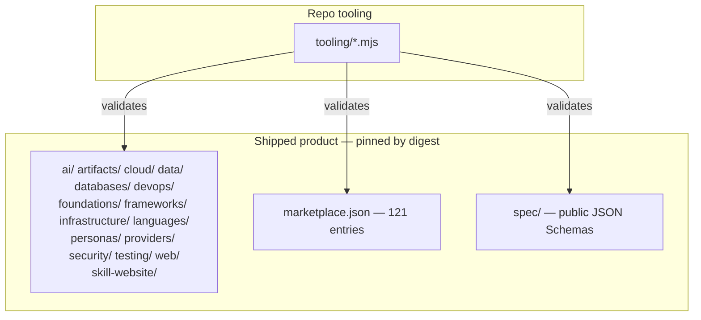

# Chainabit Plugins — agent instructions

Public, zero-install repository. No `package.json`, no dependencies, Node 20. Everything here is
either **shipped product** or **the tooling that validates it**. Know which one you are touching
before you edit anything.

## Product vs tooling



Every category directory is published, versioned marketplace payload. Each `marketplace.json` entry
pins an immutable `revision` plus `integrity.packageSha256`, so **editing a shipped plugin without
bumping its version and regenerating the digest breaks installs.**

Two traps:

- `personas/persona-reviewer/agents/senior-reviewer.md` and `commands/review.md` look exactly like
  Claude Code's `.claude/agents/` and `.claude/commands/` files. They are **marketplace payload**,
  installed into an end user's project. They are not this repo's agent configuration.
- `tooling/` is the one mixed directory. The `*.mjs` files are repo tooling;
  `tooling/skill-cli-design/` and `tooling/skill-developer-tooling/` are product.

## Verify

```bash
node tooling/validate-marketplace.mjs                   # the gate — run before every PR
node --test tooling/marketplace-contract.test.mjs       # semantic fixtures
node tooling/resolve-skills.mjs skill-pdf               # composition resolution
node tooling/validate-marketplace.mjs --write-bundles   # regenerate bundle.json inventories
```

CI runs exactly these four, plus a credential-pattern scan, on PRs and pushes to `main`,
`development`, `development-rebased`.

## Invariants the validator enforces

- A skill's directory name **must equal** the `name` in its `SKILL.md` frontmatter, lowercase.
- A skill containing `scripts/` **must** declare `permissions.execute: true`.
- An executing component **must** declare matching authority.
- Every `marketplace.json` entry **must** carry `integrity.packageSha256`.
- Compatibility plugins **must** declare `aliasOf` and carry no duplicate payload.

`skill-website/` exists solely to preserve a historical plugin id. Do not rename or move it.

## Review boundaries

`spec/`, `tooling/`, `marketplace.json`, `SECURITY.md`, `security/`, `providers/` are
CODEOWNERS-gated as contract and supply-chain boundaries. Changes there need explicit review.

`registry/` is not a data store — it documents that trust and verification badges are **not**
settable by editing this repo. Absence of a trust record means "not verified", never "verified
false".

## Public repository

This repo is public. Never add internal service or type names, private source paths, internal
infrastructure, unpublished strategy, tenant identifiers, or credentials. `acme.example` and
`internal.invalid` are deliberate non-resolving placeholders — keep them that way.
