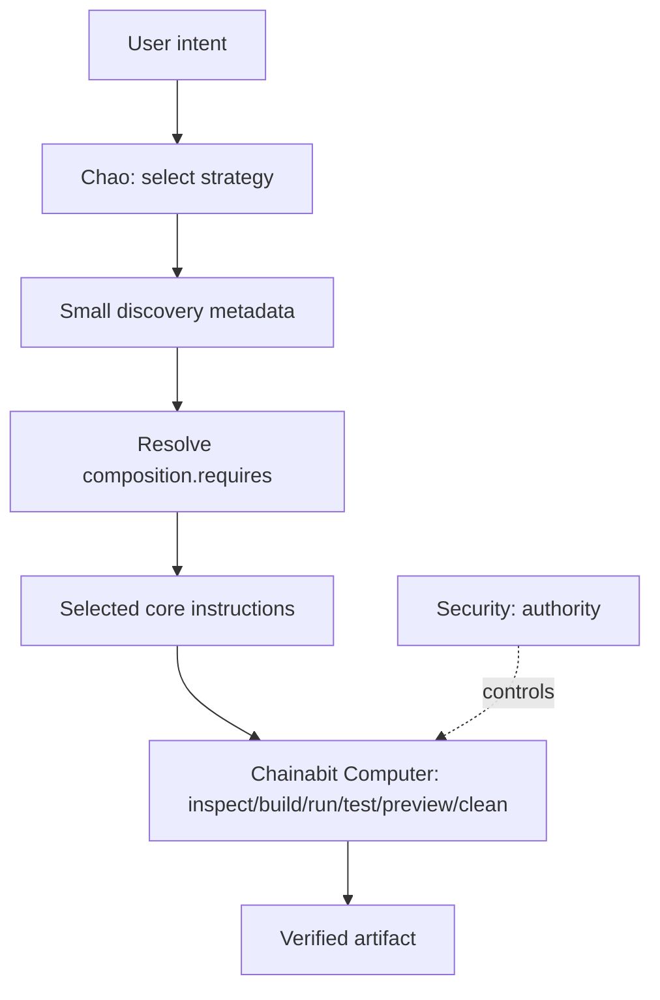

# Composable capability architecture

Each plugin owns one coherent capability and may declare `composition.requires` in its
manifest. Resolution is dependency-first and deduplicated by `tooling/resolve-skills.mjs`.
The manifest and discovery description are selection metadata; they are not a permission
system. Install permissions remain explicit in `chainabit-plugin.json`, while runtime
authority remains with security and Chainabit Computer.

The repository is physically grouped into foundations, web, languages, frameworks, artifacts,
providers, personas, infrastructure, databases, cloud, devops, testing, security, data, ai,
and tooling. These directories organize source code only; they are not execution or
authorization boundaries. Manifests own stable plugin identity, while marketplace fragments
locate roots and the resolver composes capabilities by ID. The validator owns the canonical
physical-category allowlist so discovery and registration cannot drift apart.

Foundations provide shared methodology. Language and framework plugins add only their
technology-specific decisions. Artifact plugins remain independent. Detailed references and
validators stay with the plugin that owns them and should be loaded only when the task needs
them.
